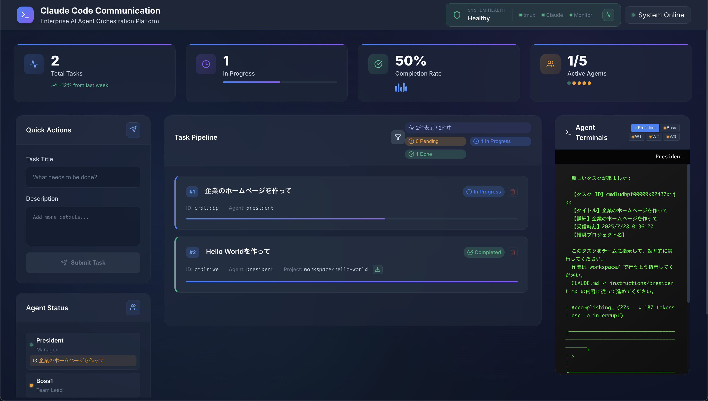

# 🤖 Claude Code エージェント通信システム

複数の AI が協力して働く、まるで会社のような開発システム + リアルタイム監視ダッシュボード



## 📌 これは何？

**3 行で説明すると：**
1. 複数の AI エージェント（社長・マネージャー・作業者）が協力して開発
2. WebUI ダッシュボードでリアルタイム監視・管理
3. 人間の組織のように役割分担して、効率的に開発を進める

**実際の成果：**
- 3 時間で完成したアンケートシステム（EmotiFlow）
- 12 個の革新的アイデアを生成
- 100% のテストカバレッジ
- WebUI ダッシュボードで完全監視

## 🎬 5 分で動かしてみよう！

### 必要なもの
- Mac または Linux
- tmux（ターミナル分割ツール）
- Claude Code CLI

### 手順

#### 1️⃣ ダウンロード（30 秒）
```bash
git clone https://github.com/nishimoto265/Claude-Code-Communication.git
cd Claude-Code-Communication
```

#### 2️⃣ 環境構築（1 分）
```bash
./setup.sh
```
これでバックグラウンドに 5 つのターミナル画面が準備されます！

#### 3️⃣ 社長画面を開いて AI 起動（2 分）

**社長画面を開く：**
```bash
tmux attach-session -t president
```

**社長画面で Claude を起動：**
```bash
# ブラウザで認証が必要
claude --dangerously-skip-permissions
```

#### 4️⃣ 部下たちを一括起動（1 分）

**新しいターミナルを開いて：**
```bash
# 4 人の部下を一括起動
for i in {0..3}; do 
  tmux send-keys -t multiagent.$i 'claude --dangerously-skip-permissions' C-m
done
```

#### 5️⃣ 部下たちの画面を確認
・各画面でブラウザでの Claude 認証が必要な場合あり
```bash
tmux attach-session -t multiagent
```
これで 4 分割された画面が表示されます：
```
┌────────┬────────┐
│ boss1  │worker1 │
├────────┼────────┤
│worker2 │worker3 │
└────────┴────────┘
```

#### 6️⃣ 魔法の言葉を入力（30 秒）

そして入力：
```
あなたは president です。おしゃれな充実した IT 企業のホームページを作成して。
```

**すると自動的に：**
1. 社長がマネージャーに指示
2. マネージャーが 3 人の作業者に仕事を割り振り
3. みんなで協力して開発
4. 完成したら社長に報告

## 🖥️ WebUI ダッシュボード（新機能！）

### 🚀 簡単起動
```bash
# WebUI を起動（ポート 3000 でアクセス）
npm run dev
```

### 📊 主要機能
- **📋 Task Pipeline**: フィルター機能付きタスク管理（検索・ステータス・プロジェクト別）
- **📈 KPI Metrics**: リアルタイム統計とパフォーマンス指標
- **👥 Agent Status**: 5 つのエージェントの稼働状況をリアルタイム監視
- **💻 Tabbed Terminals**: 各エージェントのターミナル出力を統合表示
- **🔄 System Health**: システム障害の自動検出と復旧機能

### 🎛️ タスク管理操作
- **📝 タスク作成**: タイトルと詳細を入力して即座に実行開始
- **🔍 詳細フィルター**: ステータス・プロジェクト・検索キーワードで絞り込み
- **⏸️ タスクキャンセル**: 実行中のタスクを安全に中断（Ctrl+C 送信）
- **🗑️ タスク削除**: workspace ディレクトリも含む完全削除
- **📦 成果物ダウンロード**: 完了・キャンセル済みタスクの ZIP ダウンロード
- **🔄 再実行**: 失敗したタスクの再試行
- **📊 統計表示**: クリックでステータス別フィルタリング

### 🎯 ステータス色の意味
- **🟢 緑**: 作業中（積極的に動作）
- **🟡 オレンジ**: 待機中（起動済みだが作業なし）
- **🔴 赤**: オフライン（未起動または障害）

### ✨ 新機能
- **タスク削除**: workspace/ディレクトリも含む完全削除
- **プロジェクトダウンロード**: 完了タスクを ZIP 形式でダウンロード
- **統計チップ**: クリックでステータス別フィルタリング（2 列 2 行レイアウト）
- **自動復旧**: システム障害時の自動復旧とマニュアル復旧オプション
- **タスクキャンセル**: 実行中タスクの安全な中断（途中成果物もダウンロード可能）
- **使用制限監視**: Claude Code 使用制限の自動検出と解除時の自動復旧

## 🏢 登場人物（エージェント）

### 👑 社長（PRESIDENT）
- **役割**: 全体の方針を決める
- **特徴**: ユーザーの本当のニーズを理解する天才
- **口癖**: 「このビジョンを実現してください」

### 🎯 マネージャー（boss1）
- **役割**: チームをまとめる中間管理職
- **特徴**: メンバーの創造性を引き出す達人
- **口癖**: 「革新的なアイデアを 3 つ以上お願いします」

### 👷 作業者たち（worker1, 2, 3）
- **worker1**: デザイン担当（UI/UX）
- **worker2**: データ処理担当
- **worker3**: テスト担当

## 💬 どうやってコミュニケーションする？

### メッセージの送り方
```bash
./agent-send.sh [相手の名前] "[メッセージ]"

# 例：マネージャーに送る
./agent-send.sh boss1 "新しいプロジェクトです"

# 例：作業者 1 に送る
./agent-send.sh worker1 "UI を作ってください"
```

### 実際のやり取りの例

**社長 → マネージャー：**
```
あなたは boss1 です。

【プロジェクト名】アンケートシステム開発

【ビジョン】
誰でも簡単に使えて、結果がすぐ見られるシステム

【成功基準】
- 3 クリックで回答完了
- リアルタイムで結果表示

革新的なアイデアで実現してください。
```

**マネージャー → 作業者：**
```
あなたは worker1 です。

【プロジェクト】アンケートシステム

【チャレンジ】
UI デザインの革新的アイデアを 3 つ以上提案してください。

【フォーマット】
1. アイデア名：[キャッチーな名前]
   概要：[説明]
   革新性：[何が新しいか]
```

## 📁 重要なファイルの説明

### 指示書（instructions/）
各エージェントの行動マニュアルです

**president.md** - 社長の指示書
```markdown
# あなたの役割
最高の経営者として、ユーザーのニーズを理解し、
ビジョンを示してください

# ニーズの 5 層分析
1. 表層：何を作るか
2. 機能層：何ができるか  
3. 便益層：何が改善されるか
4. 感情層：どう感じたいか
5. 価値層：なぜ重要か
```

**boss.md** - マネージャーの指示書
```markdown
# あなたの役割
天才的なファシリテーターとして、
チームの創造性を最大限に引き出してください

# 10 分ルール
10 分ごとに進捗を確認し、
困っているメンバーをサポートします
```

**worker.md** - 作業者の指示書
```markdown
# あなたの役割
専門性を活かして、革新的な実装をしてください

# タスク管理
1. やることリストを作る
2. 順番に実行
3. 完了したら報告
```

### CLAUDE.md
システム全体の設定ファイル
```markdown
# Agent Communication System

## エージェント構成
- PRESIDENT: 統括責任者
- boss1: チームリーダー  
- worker1,2,3: 実行担当

## メッセージ送信
./agent-send.sh [相手] "[メッセージ]"
```

## 🎨 実際に作られたもの：EmotiFlow

### 何ができた？
- 😊 絵文字で感情を表現できるアンケート
- 📊 リアルタイムで結果が見られる
- 📱 スマホでも使える

### 試してみる
```bash
cd emotiflow-mvp
python -m http.server 8000
# ブラウザで http://localhost:8000 を開く
```

### ファイル構成
```
emotiflow-mvp/
├── index.html    # メイン画面
├── styles.css    # デザイン
├── script.js     # 動作ロジック
└── tests/        # テスト
```

## 🔧 困ったときは

### Q: エージェントが反応しない
```bash
# 状態を確認
tmux ls

# 再起動
./setup.sh
```

### Q: メッセージが届かない
```bash
# ログを見る
cat logs/send_log.txt

# 手動でテスト
./agent-send.sh boss1 "テスト"
```

### Q: 最初からやり直したい
```bash
# 全部リセット
tmux kill-server
rm -rf ./tmp/*
./setup.sh
```

## 🚀 自分のプロジェクトを作る

### 簡単な例：TODO アプリを作る

社長（PRESIDENT）で入力：
```
あなたは president です。
TODO アプリを作ってください。
シンプルで使いやすく、タスクの追加・削除・完了ができるものです。
```

すると自動的に：
1. マネージャーがタスクを分解
2. worker1 が UI 作成
3. worker2 がデータ管理
4. worker3 がテスト作成
5. 完成！

## 📊 システムの仕組み（図解）

### 画面構成
```
┌─────────────────┐
│   PRESIDENT     │ ← 社長の画面（紫色）
└─────────────────┘

┌────────┬────────┐
│ boss1  │worker1 │ ← マネージャー（赤）と作業者 1（青）
├────────┼────────┤
│worker2 │worker3 │ ← 作業者 2 と 3（青）
└────────┴────────┘
```

### コミュニケーションの流れ
```
社長
 ↓ 「ビジョンを実現して」
マネージャー
 ↓ 「みんな、アイデア出して」
作業者たち
 ↓ 「できました！」
マネージャー
 ↓ 「全員完了です」
社長
```

### 進捗管理の仕組み
```
./tmp/
├── {taskId}/            # タスク専用ディレクトリ
├── worker1_done.txt     # 作業者 1 が完了したらできるファイル
├── worker2_done.txt     # 作業者 2 が完了したらできるファイル
├── worker3_done.txt     # 作業者 3 が完了したらできるファイル
└── worker*_progress.log # 進捗の記録
```

### 📋 タスク処理フローの詳細

#### 1. タスク登録後の自動処理（1 秒以内）
```
WebUI でタスク登録
    ↓
📊 データベースに保存（status: 'pending'）
    ↓
🔄 メモリキャッシュ更新
    ↓
📡 全クライアントに 'task-queued' 通知
    ↓
⏰ 1 秒後に processTaskQueue() 実行
```

#### 2. タスクキュー処理の内部動作
```
🔍 進行中タスクの完了チェック
   └── 全 worker の tmp/{taskId}_done.txt を確認
   └── 完了なら status: 'completed' に更新
   └── tmp/{taskId}/ ディレクトリをクリーンアップ

🚫 Usage Limit チェック
   └── 制限中なら処理を一時停止
   └── 解除時刻になったら自動再開

🎯 次タスクの割り当て
   └── 優先順位: paused > pending
   └── assignTaskToPresident() 実行
```

#### 3. President への自動指示システム
```
📁 プロジェクト環境準備
   ├── タイトルから projectName 生成
   ├── workspace/{projectName}/ 作成
   └── tmp/{taskId}/ 作成

🧹 全エージェントリセット
   ├── president に /clear 送信
   ├── boss1 に /clear 送信
   ├── worker1-3 に /clear 送信
   └── 300ms ずつ間隔を開けて実行

👑 President への指示送信
   ├── タスク詳細を構造化して送信
   ├── 推奨プロジェクト名を提示
   └── instructions/president.md に基づく指示

📊 ステータス更新
   ├── status: 'in_progress'
   ├── assignedTo: 'president'
   ├── projectName: 自動生成値
   └── エージェント状態: 'working'
```

#### 4. 継続監視システム
```
⏰ 30 秒ごとの定期処理
   ├── processTaskQueue() 再実行
   ├── 完了検知の自動化
   └── 新規タスクの自動処理

🔍 使用制限監視（1 分ごと）
   ├── データベースの nextRetryAt 確認
   ├── 解除時刻到達で自動クリア
   └── President に進捗確認メッセージ送信

💊 自動復旧機能
   ├── システム障害検出
   ├── tmux セッション復旧
   └── エージェント状態の正常化
```

#### 5. タスクライフサイクル管理
```
pending → in_progress → completed
   ↑           ↓            ↓
cancelled ←----+      ダウンロード可能
   ↓
途中成果物もダウンロード可能
```

**タスクステータスの意味:**
- **pending**: 待機中（キューに登録済み）
- **in_progress**: 実行中（President が作業開始）
- **completed**: 完了（全 worker 完了確認済み）
- **cancelled**: キャンセル済み（途中成果物保持）
- **failed**: 失敗（再試行またはキャンセル選択可能）
- **paused**: 一時停止（Usage Limit 等で中断）

## 💡 なぜこれがすごいの？

### 従来の開発
```
人間 → AI → 結果
```

### このシステム
```
人間 → AI 社長 → AI マネージャー → AI 作業者×3 → 統合 → 結果
```

**メリット：**
- 並列処理で 3 倍速い
- 専門性を活かせる
- アイデアが豊富
- 品質が高い

## 🎓 もっと詳しく知りたい人へ

### プロンプトの書き方

**良い例：**
```
あなたは boss1 です。

【プロジェクト名】明確な名前
【ビジョン】具体的な理想
【成功基準】測定可能な指標
```

**悪い例：**
```
何か作って
```

### カスタマイズ方法

**新しい作業者を追加：**
1. `instructions/worker4.md`を作成
2. `setup.sh`を編集してペインを追加
3. `agent-send.sh`にマッピングを追加

**タイマーを変更：**
```bash
# instructions/boss.md の中の
sleep 600  # 10 分を 5 分に変更するなら
sleep 300
```

## 🌟 まとめ

このシステムは、複数の AI が協力することで：
- **3 時間**で本格的な Web アプリが完成
- **12 個**の革新的アイデアを生成
- **100%**のテストカバレッジを実現

ぜひ試してみて、AI チームの力を体験してください！

---

**作者**: [GitHub](https://github.com/nishimoto265/Claude-Code-Communication)
**ライセンス**: MIT
**質問**: [Issues](https://github.com/nishimoto265/Claude-Code-Communication/issues) へどうぞ！


## 参考リンク
    
・ Claude Code 公式   
　　URL: https://docs.anthropic.com/ja/docs/claude-code/overview   
    
・ Tmux Cheat Sheet & Quick Reference | Session, window, pane and more     
　　URL: https://tmuxcheatsheet.com/   
     
・ Akira-Papa/Claude-Code-Communication   
　　URL: https://github.com/Akira-Papa/Claude-Code-Communication   
     
・【tmux で Claude Code の Max プランで AI 組織を動かし放題のローカル環境ができた〜〜〜！ので、やり方をシェア！！🔥🔥🔥🙌☺️】 #AI エージェント - Qiita   
　　URL: https://qiita.com/akira_papa_AI/items/9f6c6605e925a88b9ac5   
    
・ Claude Code コマンドチートシート完全ガイド #ClaudeCode - Qiita   
　　URL: https://qiita.com/akira_papa_AI/items/d68782fbf03ffd9b2f43   
    
    
※以下の情報を参考に、今回の tmux の Claude Code 組織環境を構築することができました。本当にありがとうございました！☺️🙌   
    
◇Claude Code 双方向通信をシェルで一撃構築できるようにした発案者の元木さん   
参考 GitHub ：   
haconiwa/README_JA.md at main · dai-motoki/haconiwa  
　　URL: https://github.com/dai-motoki/haconiwa/blob/main/README_JA.md   
    
・神威/KAMUI（@kamui_qai）さん / X   
　　URL: https://x.com/kamui_qai   
    
◇簡単に Claude Code 双方向通信環境を構築できるようシェアして頂いたダイコンさん   
参考 GitHub：   
nishimoto265/Claude-Code-Communication   
　　URL: https://github.com/nishimoto265/Claude-Code-Communication   
    
・ ダイコン（@daikon265）さん / X   
　　URL: https://x.com/daikon265   
    
◇Claude Code 公式解説動画：   
Mastering Claude Code in 30 minutes - YouTube   
　　URL: https://www.youtube.com/live/6eBSHbLKuN0?t=1356s  
   
