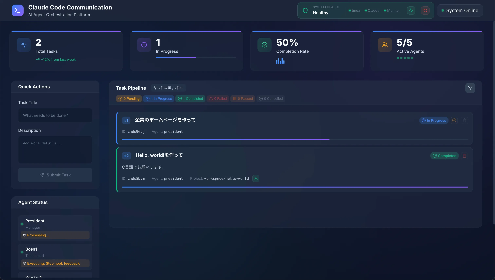

# Claude Code Communication
[](https://deepwiki.com/yuru-sha/Claude-Code-Communication)

複数の AI エージェントが協力してタスクを実行するシステムです。



## 特徴

- 5 つの AI エージェントが役割分担して作業
- WebUI でリアルタイム監視・管理
- 自動復旧機能
- プロジェクトファイルのダウンロード
- タスクの進捗管理

## 始め方

### 前提条件

- Node.js 18+
- Claude Code CLI (`claude` コマンド)
- tmux

### セットアップ

```bash
# リポジトリをクローン
git clone https://github.com/yuru-sha/Claude-Code-Communication.git
cd Claude-Code-Communication

# 依存関係をインストール
npm install

# データベースセットアップ
npx prisma generate
npx prisma migrate dev

# システム起動
npm run dev
```

WebUI: http://localhost:3000

## エージェント構成

| エージェント | 役割 |
|-------------|------|
| President | プロジェクト統括 |
| Boss1 | チームマネジメント |
| Worker1 | フロントエンド開発 |
| Worker2 | バックエンド開発 |
| Worker3 | インフラ・テスト |

## 使い方

1. WebUI でタスクを入力
2. Task Pipeline で進捗確認
3. 完了後にプロジェクトファイルをダウンロード

### サンプルタスク

**例 1: フルスタック Web アプリ**
```
タイトル: TODO リストアプリの作成
詳細: React と TypeScript を使った TODO リストアプリを作成してください。
機能要件: タスクの追加、削除、完了、優先度設定
技術要件: Prisma + SQLite、Express.js API、レスポンシブデザイン
```

**例 2: API 開発**
```
タイトル: ユーザー管理 API
詳細: Express.js と TypeScript でユーザー管理 API を作成してください。
機能要件: JWT 認証、CRUD 操作、ロールベースアクセス制御
技術要件: OpenAPI 仕様書、ユニットテスト、Docker 化
```

## 技術スタック

### フロントエンド
- React 19 + TypeScript
- Vite + TailwindCSS 4.1.11
- Lucide React（アイコン）
- Socket.IO Client

### バックエンド
- Node.js + Express 5
- Prisma ORM + SQLite
- Socket.IO Server
- tmux（プロセス管理）
- archiver（ZIP 圧縮）

## システム監視

### WebUI ダッシュボード

- **KPI メトリクス**: タスク完了率、エージェント稼働率、システム健康状態
- **タスクパイプライン**: リアルタイムタスク進捗、フィルタリング機能
- **エージェント状態**: 各エージェントの作業状況と効率指標
- **エージェント監視**: 各エージェントの作業状況をリアルタイム表示

### システムヘルス監視

- **tmux**: tmux セッションの状態（緑/黄/赤）
- **Claude**: Claude エージェントの稼働状況（5/5 が理想）
- **Monitor**: タスク完了監視システムの状態

### 自動復旧機能

- **自動検知**: エージェント異常の自動検出
- **自動復旧**: システム障害時の自動復旧実行
- **手動復旧**: WebUI の手動復旧ボタンで緊急復旧

### tmux セッション確認（上級者向け）

```bash
# アクティブなセッション一覧
tmux list-sessions

# エージェント作業画面確認
tmux attach-session -t multiagent  # Boss1 + Worker1-3
tmux attach-session -t president    # President

# セッションから抜ける: Ctrl+B, D
```

## トラブルシューティング

### 推奨復旧手順
1. **WebUI の手動復旧**: 「手動復旧」ボタンをクリック（自動復旧実行）
2. **システムヘルス確認**: 全インジケーターが緑色になるまで待機
3. **エージェント状態確認**: Agent Status で全エージェントが稼働中か確認

### よくある問題と対処法

#### エージェント関連
- **エージェント未起動**: 自動復旧機能が自動対応
- **部分的障害**: WebUI の手動復旧ボタンで個別復旧
- **完全停止**: `./launch-agents.sh` で手動起動（最終手段）

#### システム関連
- **ポート競合**: `PORT=3002 npm run dev` でポート変更
- **データベースエラー**: `rm -f data/database.db && npx prisma migrate dev`
- **tmux セッション異常**: `tmux kill-server && npm run dev`

#### WebUI 関連
- **接続エラー**: ブラウザのリロード、開発者ツールで Socket.IO 接続確認
- **タスク処理停止**: Agent Status で President 状態確認

## ドキュメント

### 基本ガイド
- [QUICKSTART.md](QUICKSTART.md) - 5 分で始めるクイックスタート
- [docs/WEBUI_USAGE.md](docs/WEBUI_USAGE.md) - WebUI 完全使用方法
- [docs/PROJECT_DOWNLOAD_GUIDE.md](docs/PROJECT_DOWNLOAD_GUIDE.md) - プロジェクトダウンロード機能
- [instructions/](instructions/) - エージェント役割定義

### 技術仕様・アーキテクチャ
- [docs/task-normal-sequence.md](docs/task-normal-sequence.md) - 正常タスク実行フロー
- [docs/task-failure-sequence.md](docs/task-failure-sequence.md) - 失敗処理フロー

### システム運用・監視
- **リアルタイム監視**: KPI メトリクス、タスクパイプライン、エージェント状態
- **自動化機能**: 自動復旧、タスク完了検知、エラー追跡
- **手動制御**: 手動復旧、タスク管理
- **成果物管理**: プロジェクトファイルの自動 ZIP 化・ダウンロード

## 元プロジェクト

このプロジェクトは [README.original.md](README.original.md) をベースに拡張したものです。

### 主な改良点
- **WebUI ダッシュボード**: tmux 手動操作から直感的な Web 操作へ
- **自動復旧システム**: 手動復旧から自動障害検知・復旧へ
- **Prisma + SQLite**: ファイルベースからデータベース永続化へ
- **リアルタイム監視**: ログファイル確認から Socket.IO リアルタイム表示へ
- **プロジェクト管理**: 成果物の自動 ZIP 化・ダウンロード機能
- **KPI ダッシュボード**: システム健康状態とパフォーマンス指標
- **TerminalOptimized**: 高速ターミナル表示とメモリ効率化

## ライセンス

MIT License

## サポート

- バグ報告: [GitHub Issues](https://github.com/yuru-sha/Claude-Code-Communication/issues)
- 質問・相談: [GitHub Discussions](https://github.com/yuru-sha/Claude-Code-Communication/discussions)
