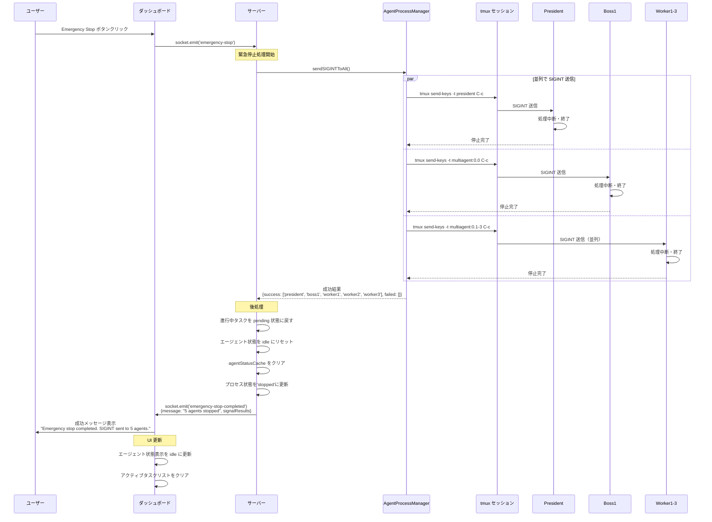
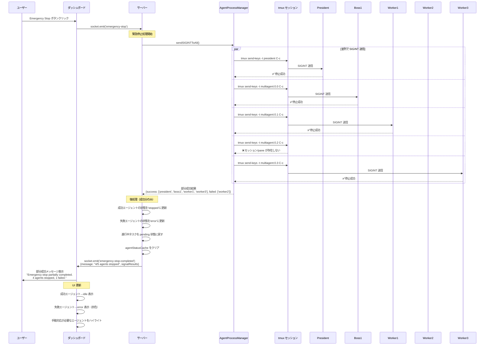
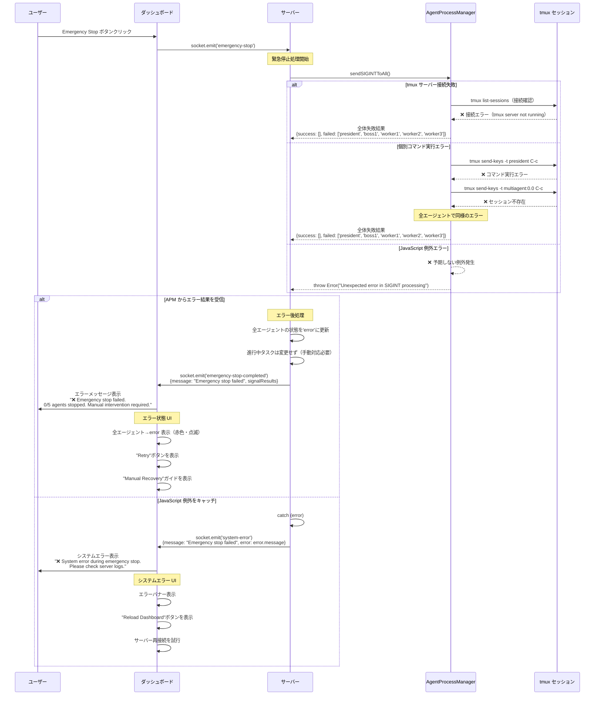
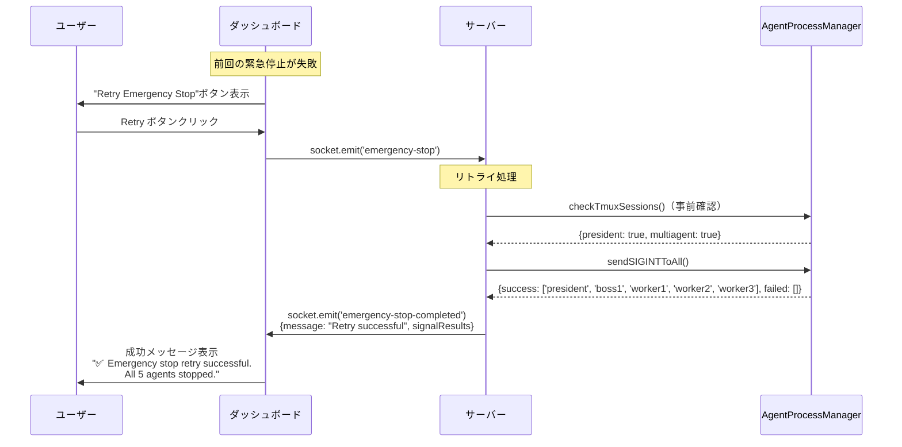

# 緊急停止処理シーケンス図

## 概要

ダッシュボードの緊急停止機能における、エージェントプロセスへの SIGINT 送信処理のシーケンス図です。

## 1. 通常フロー（正常処理）

### 全エージェント停止成功のケース



## 2. キャンセルフロー（部分成功）

### 一部エージェントの停止に失敗したケース



## 3. 失敗フロー（異常処理）

### システムエラーや tmux 接続失敗のケース



## 4. リトライ・復旧フロー

### 失敗後の手動リトライケース



## エラーハンドリング詳細

### エラーの種類と対応

| エラー種類 | 原因 | APM の対応 | サーバーの対応 | UI の表示 |
|------------|------|-----------|----------------|----------|
| tmux 接続失敗 | tmux サーバー未起動 | 全エージェント failed | 全エージェント→error | システムエラー + 復旧ガイド |
| セッション不存在 | 特定セッション/pane 消失 | 該当エージェント failed | 部分的 error 状態 | 部分失敗 + Retry 推奨 |
| コマンド実行エラー | 権限不足・システム負荷 | 該当エージェント failed | 部分的 error 状態 | 部分失敗 + Manual Recovery |
| JavaScript 例外 | 予期しないエラー | 例外 throw | システムエラー送信 | システムエラー + Reload 推奨 |

## 技術仕様

### AgentProcessManager 主要メソッド
- `sendSIGINT(agentId)`: 個別エージェント停止
- `sendSIGINTToAll()`: 全エージェント一括停止
- `getProcessId(agentId)`: プロセス ID 取得
- `checkTmuxSessions()`: tmux 接続確認
- `updateAgentStatus()`: 状態更新

### tmux コマンド仕様
```bash
# 事前確認
tmux has-session -t president
tmux has-session -t multiagent

# SIGINT 送信
tmux send-keys -t president C-c
tmux send-keys -t multiagent:0.0 C-c  # Boss1
tmux send-keys -t multiagent:0.1 C-c  # Worker1
tmux send-keys -t multiagent:0.2 C-c  # Worker2
tmux send-keys -t multiagent:0.3 C-c  # Worker3
```

### WebSocket イベント仕様
```typescript
// クライアント→サーバー
socket.emit('emergency-stop')

// サーバー→クライアント（成功）
socket.emit('emergency-stop-completed', {
  message: "Emergency stop completed. SIGINT sent to 5 agents.",
  signalResults: { success: [...], failed: [...] },
  timestamp: new Date()
})

// サーバー→クライアント（システムエラー）
socket.emit('system-error', {
  message: "Emergency stop failed",
  error: "tmux server not running",
  timestamp: new Date()
})
```