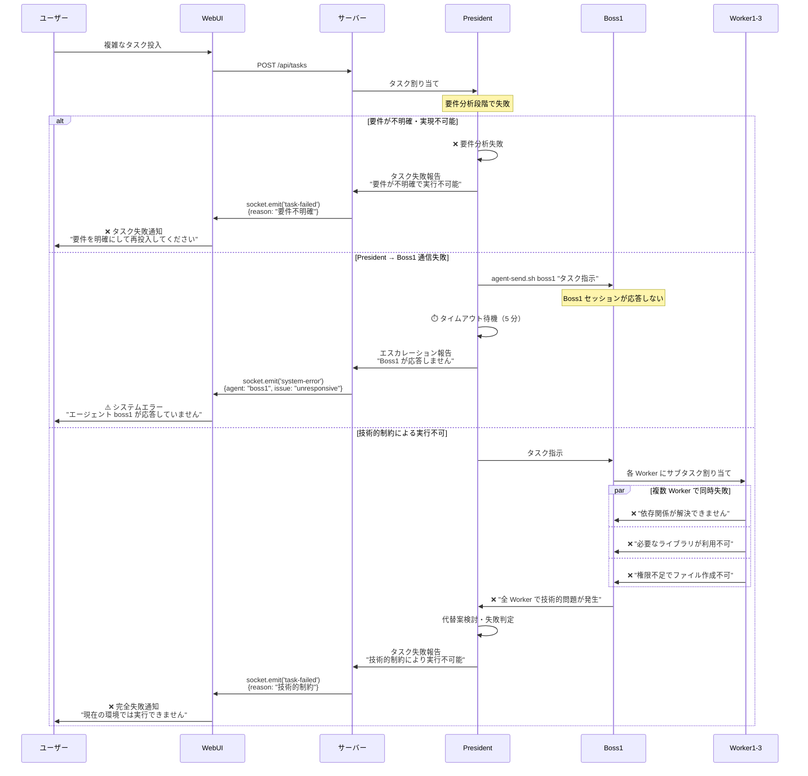
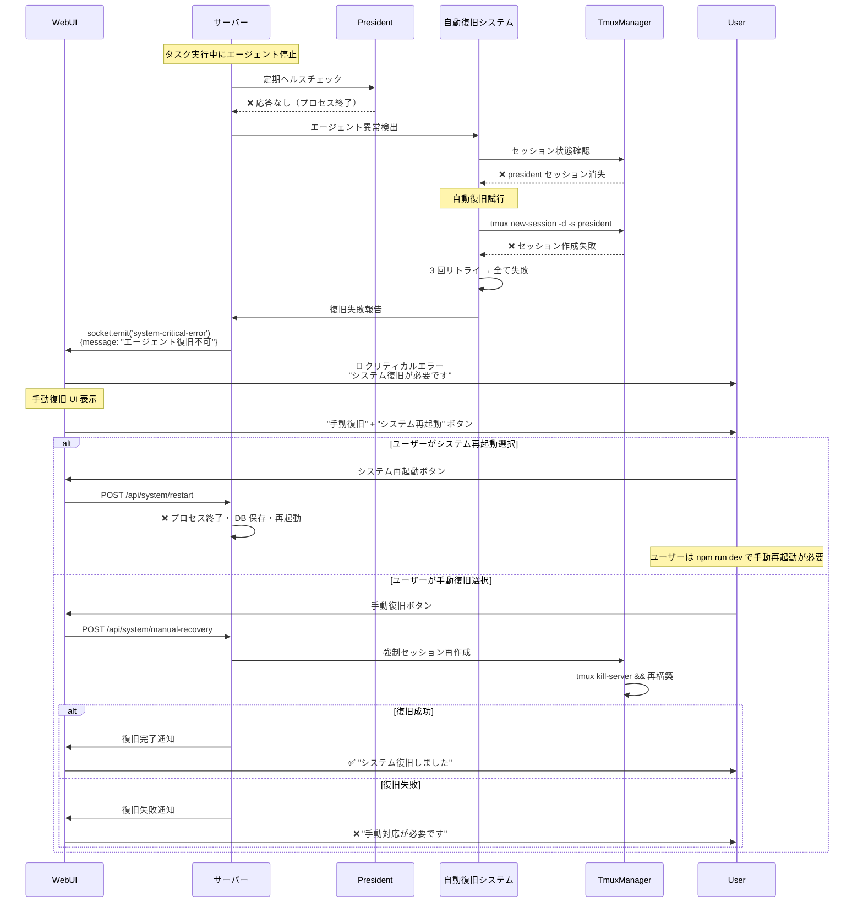
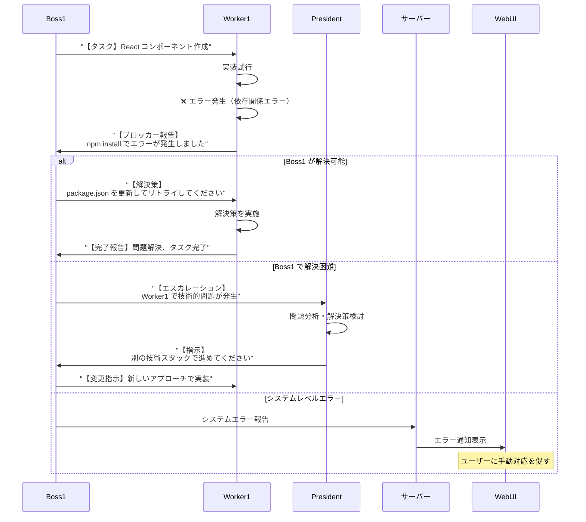
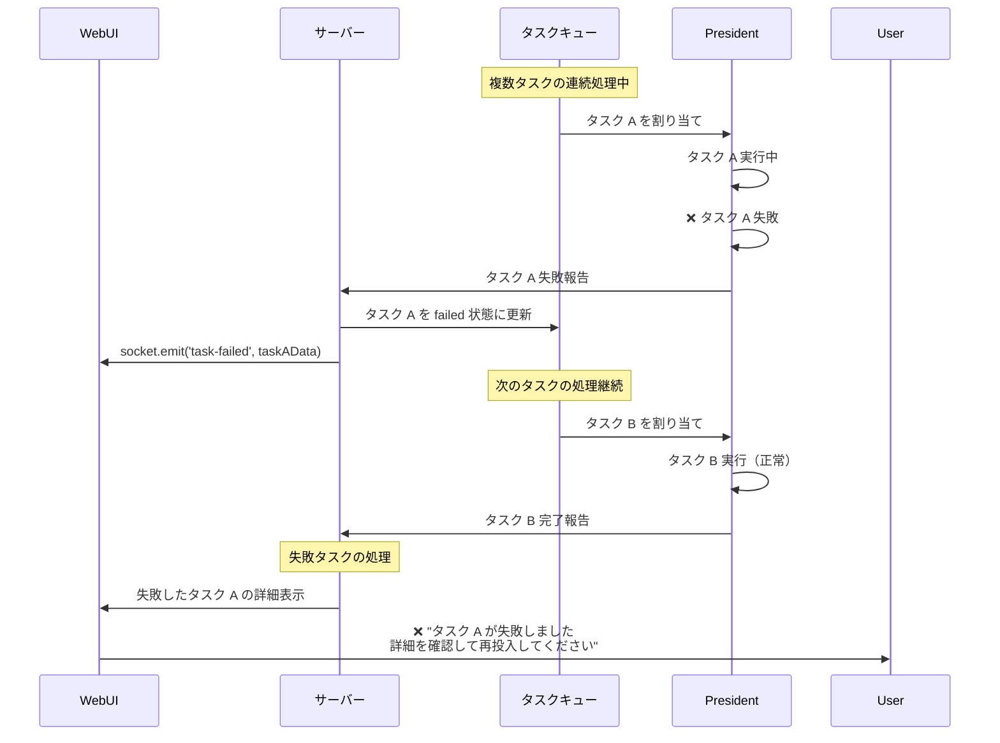

# タスク実行失敗フロー

## 概要

AI エージェント通信システムにおける、タスク実行時の失敗・エラー処理フローのシーケンス図です。

## 失敗フロー（異常処理）

### タスク実行失敗・完全中断のケース



### エージェント接続断・復旧失敗のケース



## エラー処理フロー

### Worker レベルでのエラー処理



### タスクキュー処理での失敗



## エラーの種類と対応

### エラー分類表

| エラー種類 | 発生場所 | 原因 | 自動復旧 | ユーザー対応 |
|------------|----------|------|----------|-------------|
| **要件不明確** | President | 仕様が曖昧・矛盾 | ❌ | 要件を明確化して再投入 |
| **通信失敗** | エージェント間 | セッション応答なし | ⚠️ 部分的 | 手動復旧 or システム再起動 |
| **技術的制約** | Worker | 依存関係・権限・環境 | ❌ | 環境設定修正・代替手段検討 |
| **システム障害** | tmux/プロセス | プロセス終了・セッション消失 | ✅ 3 回試行 | 手動復旧 or 完全再起動 |
| **リソース不足** | システム全体 | メモリ・ CPU ・ディスク | ❌ | システムリソース確保 |

### 復旧手順

#### 1. 軽微なエラー（自動復旧可能）
```bash
# システムが自動で実行
1. エラー検出
2. 3 回まで自動リトライ
3. 復旧成功 → 処理継続
4. 復旧失敗 → 手動復旧フローへ
```

#### 2. 中程度のエラー（手動復旧必要）
```bash
# WebUI の手動復旧ボタン
1. 手動復旧ボタンクリック
2. システムが自動診断
3. 復旧可能な問題を修正
4. エージェント再起動
5. 復旧完了 or エスカレーション
```

#### 3. 重大なエラー（システム再起動必要）
```bash
# 完全システム再起動
1. システム再起動ボタンクリック
2. 全プロセス終了・状態保存
3. ユーザーが npm run dev で再起動
4. システム正常性確認
5. 失敗タスクの再投入検討
```

## 予防策

### エラー予防のベストプラクティス

1. **要件明確化**
   - 具体的なタスク記述
   - 期待する成果物の明示
   - 技術的制約の事前確認

2. **システム監視**
   - エージェント状態の定期チェック
   - リソース使用量の監視
   - ログ出力の詳細化

3. **エラー早期発見**
   - 段階的な実装・テスト
   - 依存関係の事前確認
   - 権限・環境の検証

4. **復旧準備**
   - バックアップ・復元手順の整備
   - 手動復旧手順の文書化
   - 緊急連絡先の明確化

## ログ出力例

### 正常時とエラー時の出力比較

```bash
# 正常時
[INFO] Task assigned to President: task-abc123
[INFO] President → Boss1: Task breakdown completed
[INFO] Boss1 → Workers: Parallel execution started
[INFO] Worker1: UI implementation completed
[INFO] Worker2: API implementation completed  
[INFO] Worker3: Infrastructure setup completed
[INFO] Boss1 → President: All subtasks completed
[INFO] President: Task task-abc123 completed successfully

# エラー時
[ERROR] Task assignment failed: task-def456
[ERROR] President: Requirements analysis failed - "Unclear specifications"
[WARN] Boss1: No response from Worker2 (timeout: 300s)
[ERROR] Worker1: npm install failed - "Permission denied"
[CRITICAL] System: All agents unresponsive - initiating recovery
[INFO] AutoRecovery: Attempting tmux session restart (attempt 1/3)
[ERROR] AutoRecovery: Session restart failed - "tmux server not running"
[CRITICAL] System: Manual intervention required
```