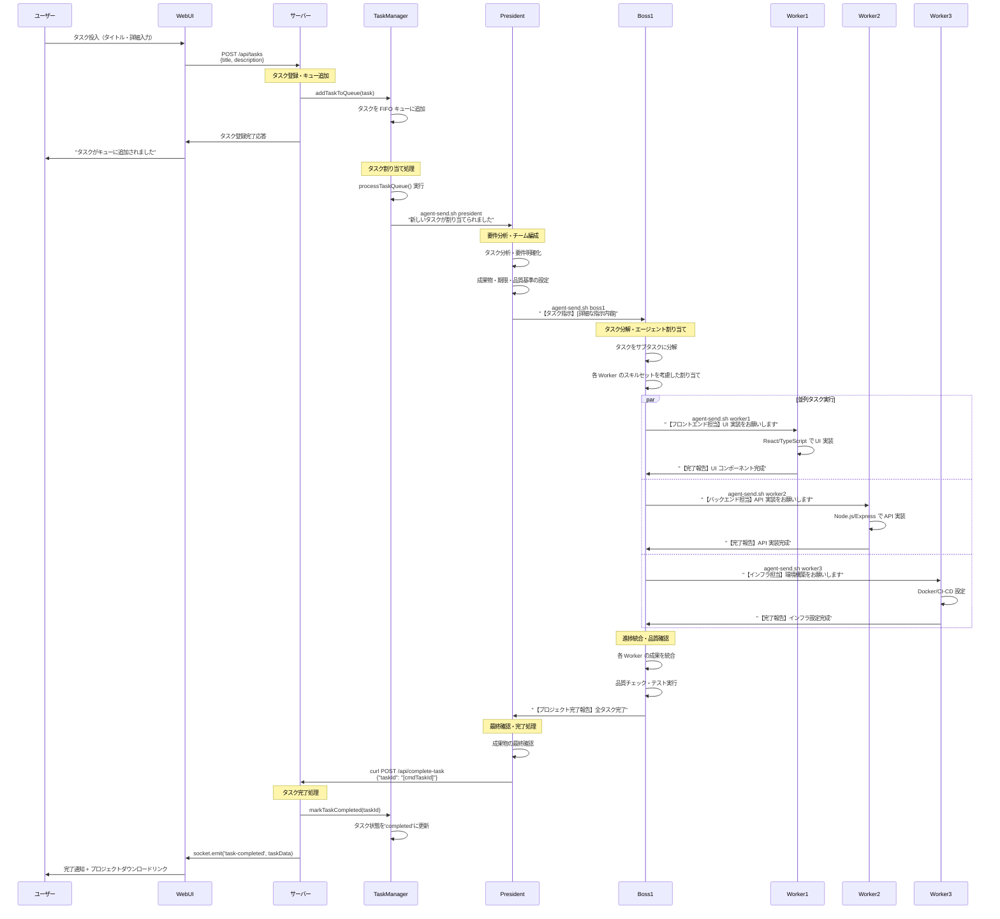
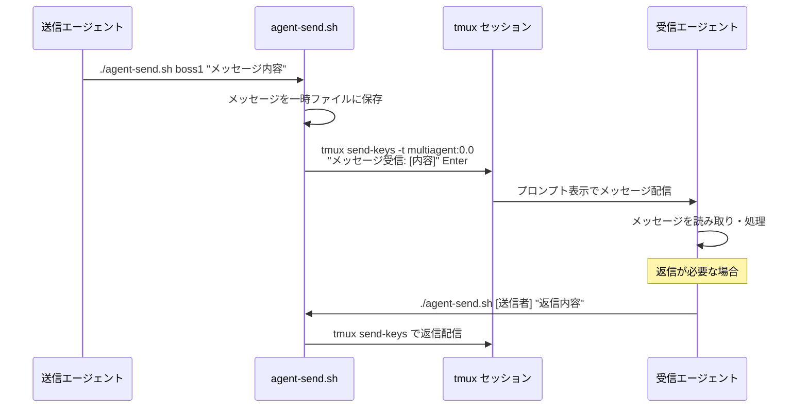
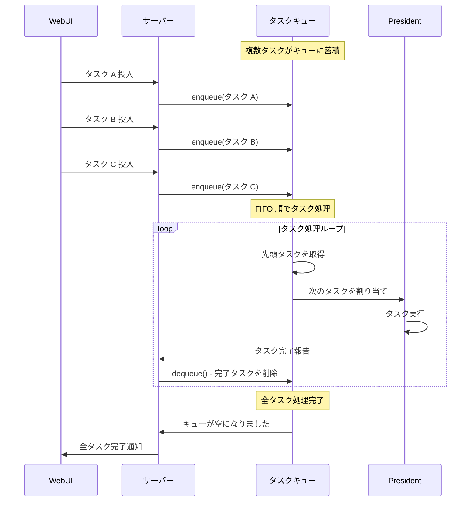
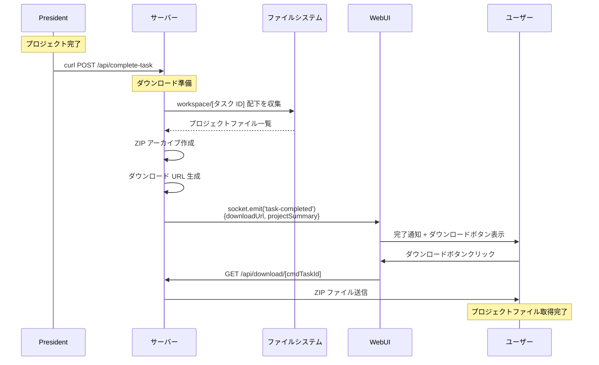

# タスク実行通常フロー

## 概要

AI エージェント通信システムにおける、正常なタスク実行フローのシーケンス図です。

## 通常フロー（正常処理）

### タスク投入から完了までの流れ



## エージェント間通信の詳細

### agent-send.sh による通信メカニズム



## タスクキュー管理フロー

### FIFO キューによるタスク処理



## プロジェクト完了・ダウンロードフロー

### 成果物の生成とダウンロード



## エージェント役割分担

### 各エージェントの責務

| エージェント | 主要責務 | 通信相手 | 成果物 |
|-------------|----------|----------|--------|
| **President** | プロジェクト統括<br/>要件分析<br/>品質保証 | Boss1 ↔ Server | プロジェクト完了報告<br/>品質基準書 |
| **Boss1** | チーム管理<br/>タスク分解<br/>進捗統合 | President ↔ Workers | タスク分解書<br/>進捗レポート |
| **Worker1** | フロントエンド開発<br/>UI/UX 実装 | Boss1 | React コンポーネント<br/>CSS スタイル |
| **Worker2** | バックエンド開発<br/>API 実装 | Boss1 | API エンドポイント<br/>データベース設計 |
| **Worker3** | インフラ構築<br/>DevOps<br/>テスト | Boss1 | Docker 設定<br/>CI/CD パイプライン |

## 技術仕様

### agent-send.sh コマンド仕様
```bash
# 基本使用法
./agent-send.sh [受信者] "[メッセージ内容]"

# 例
./agent-send.sh boss1 "新しいタスクが追加されました"
./agent-send.sh worker1 "フロントエンド実装をお願いします"
```

### tmux セッション構成
```bash
# President (独立セッション)
tmux new-session -d -s president

# MultiAgent (4 ペイン構成)
tmux new-session -d -s multiagent \; \
  split-window -h \; \
  split-window -v \; \
  select-pane -t 0 \; \
  split-window -v

# ペイン割り当て
# multiagent:0.0 → Boss1
# multiagent:0.1 → Worker1  
# multiagent:0.2 → Worker2
# multiagent:0.3 → Worker3
```

### WebSocket イベント
```typescript
// タスク関連
socket.emit('task-queued', taskData)      // タスクキュー追加
socket.emit('task-assigned', taskData)    // タスク割り当て
socket.emit('task-completed', taskData)   // タスク完了

// エージェント状態
socket.emit('agent-status-update', agentStatus)  // エージェント状態更新
socket.emit('agent-activity-detected', activity) // エージェント活動検出
```